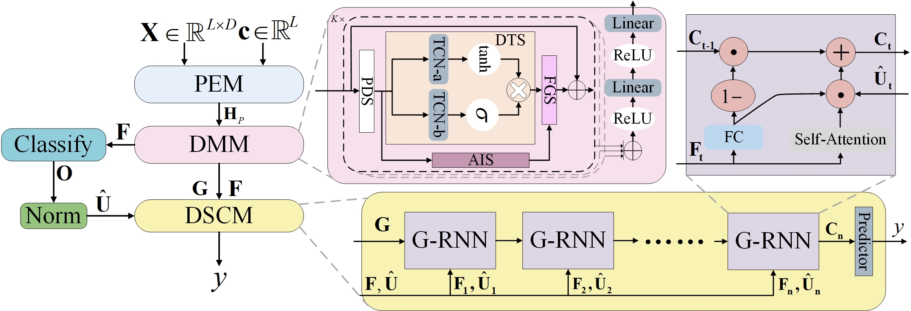
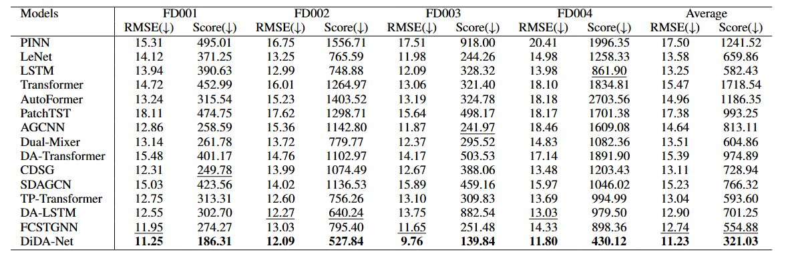
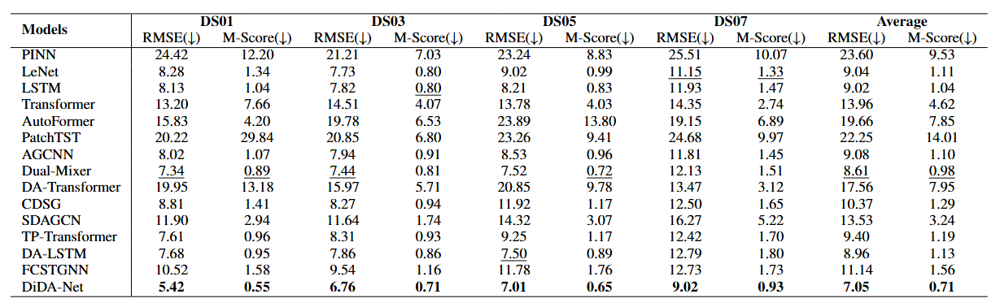
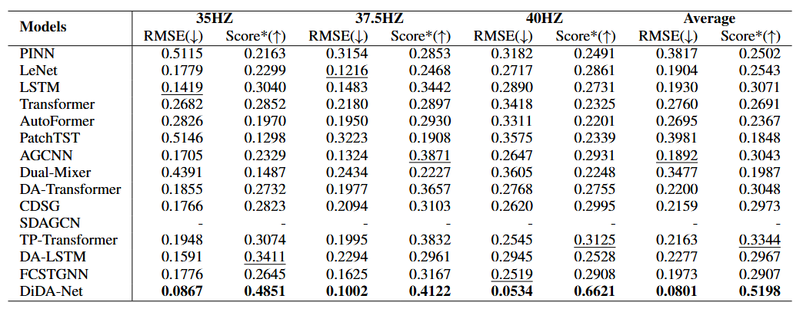

# DiDA_Net 

A official pytorch implementation for the paper: ' *DiDA-Net: Difference and Dynamic Graph Assisted Network for RUL Prediction* ' 

## 🎯Introduction

This is the pytorch implementation of DiDA_Net. 
Unlike conventional prediction methods, DiDA_Net pay close attention to changes in sensor states during the degradation feature extraction process.
Additionally, extensive experiments on three datasets from prognostics and health management systems show that DiDA-Net achieves average performance improvements of 11.85\% to 57.66\%  over the best baseline models.
The architecture of our model(DiDA_Net) is shown as below:



## Setup

### Table of Contents:

- <a href='#Install dependecies'>1. Install dependecies </a>
- <a href='#Download the data'>2. Download the data</a>
- <a href='#Experimental setup'>3. Experimental setup</a>

<span id='Install dependecies'/>

### 📝1. Install dependecies
Install the required packages
```
pip install -r requirements.txt
```


<span id='Download the data'/>

### 👉2. Download the data
We follow the same setting as previous work. The datasets are placed in the 'datasets' folder of our project. The tree structure of the files are as follows:

```
datasets
   ├─CMAPSS
   │
   ├─N_CMAPSS
   │
   └─XJTU
```

<span id='Experimental setup'/>

### 🚀3. Experimental setup
We have provided all the experimental scripts for the benchmark in the corresponding section of the `./scripts` folder, which covers all the benchmarking experiments. To reproduce the results, you can run the following shell code.

The running script of DiDA_Net on three datasets
```bash
 ./DiDA_Net/scripts/CMAPSS.sh
 ./DiDA_Net/scripts/N_CMAPSS.sh
 ./DiDA_Net/scripts/XJTU.sh
```
## Results
The prediction results of the CMAPSS dataset.



The prediction results of the N_CMAPSS dataset.



The prediction results of the XJTU dataset.



